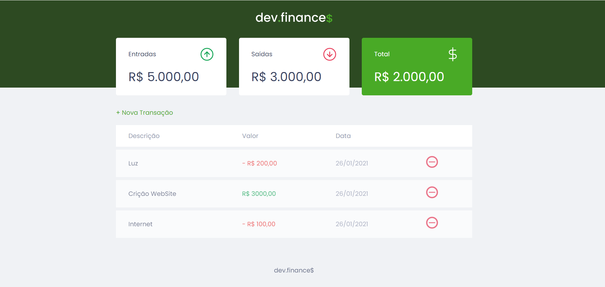

<h1 align="center">
  
</h1>

## 🖥 Preview 

<div align="center">
    
</div>

## 📌 Table of Contents

- [Technology](#-technology)
- [Project](#-project)
- [Implementation ideas](#-implementation-ideas)
- [Installation](#-installation)


## 🛠 Technology

- **Front-End**
  - [HTML](https://developer.mozilla.org/pt-BR/docs/Web/HTML)
  - [CSS](https://developer.mozilla.org/pt-BR/docs/Web/CSS)
  - [Javascript](https://developer.mozilla.org/pt-BR/docs/Web/Javascript)
  
  
## 💻 Project

System developed to help people with their finances. This is a project developed at the DIscover Marathon, carried out by [Rocketseat](https://github.com/Rocketseat), with the instruction of Mayk Brito.

## 💡 My ideas implanted
 - ⬛ Dark Mode


## ⬇ Installation

```bash
# Clone this repository
$ git clone https://github.com/LucasHoldefer/Dev-Finances.git
```